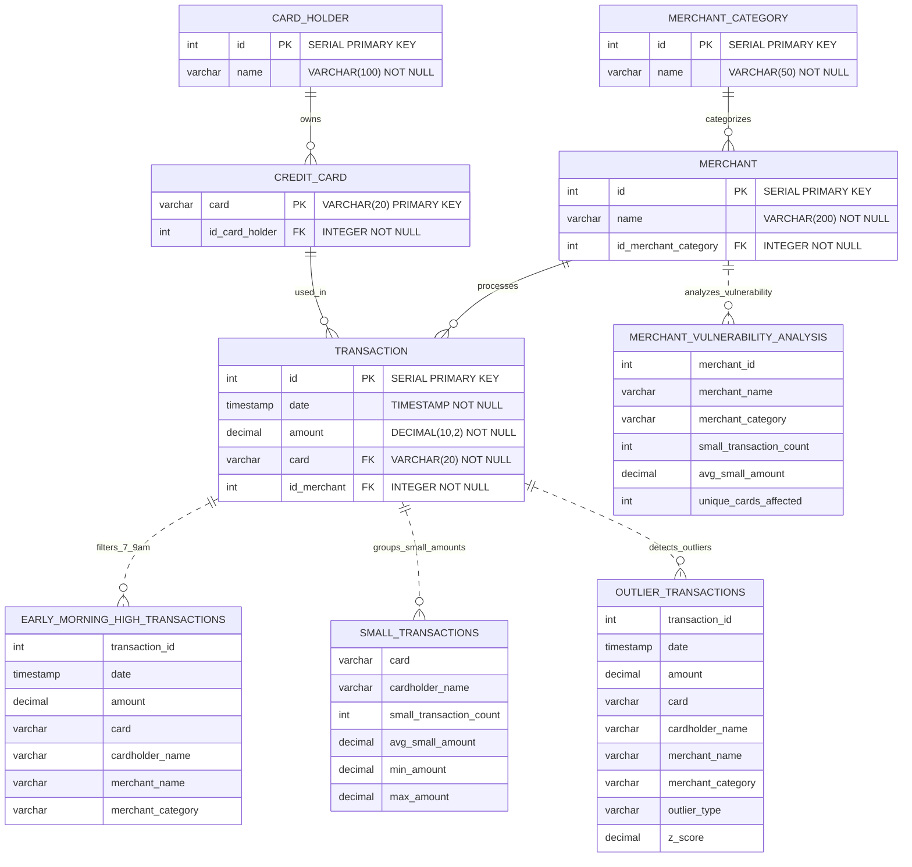

## Fraud Detection Database - ERD Explanation

### **Core Entities:**

1. **MERCHANT_CATEGORY** - Business type classifications (restaurant, coffee shop, bar, pub, food truck)
2. **CARD_HOLDER** - Individual customers who own credit cards
3. **MERCHANT** - Businesses that process transactions
4. **CREDIT_CARD** - Individual credit cards linked to cardholders
5. **TRANSACTION** - Individual purchase transactions

### **Key Relationships:**

- **One-to-Many**: Each merchant category can have multiple merchants
- **One-to-Many**: Each cardholder can have multiple credit cards
- **One-to-Many**: Each credit card can have multiple transactions
- **One-to-Many**: Each merchant can process multiple transactions

### **Fraud Detection Views:**

The diagram also shows the specialized views created for fraud detection:

- **EARLY_MORNING_HIGH_TRANSACTIONS**: Filters transactions between 7-9 AM
- **SMALL_TRANSACTIONS**: Groups cards with multiple small transactions (<$2)
- **MERCHANT_VULNERABILITY_ANALYSIS**: Analyzes merchants prone to fraud
- **OUTLIER_TRANSACTIONS**: Statistical outlier detection using IQR and Z-score

### **Data Integrity:**

- **Primary Keys**: Ensure unique identification of each record
- **Foreign Keys**: Maintain referential integrity between related tables
- **NOT NULL constraints**: Ensure critical data is always present
- **Indexes**: Optimize query performance for fraud detection queries

This ERD represents a normalized database design optimized for fraud detection analysis with proper relationships and constraints to ensure data integrity.
